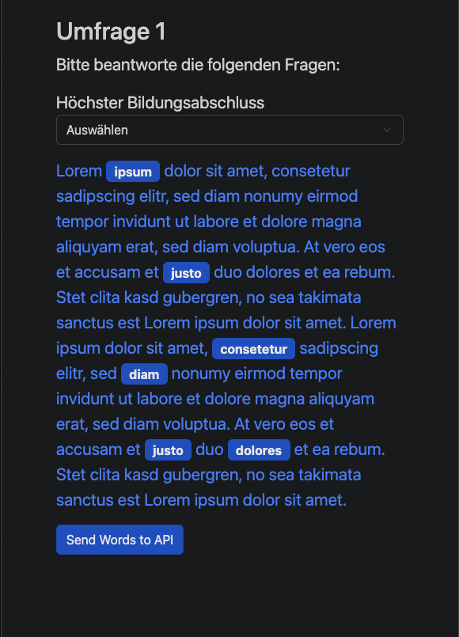
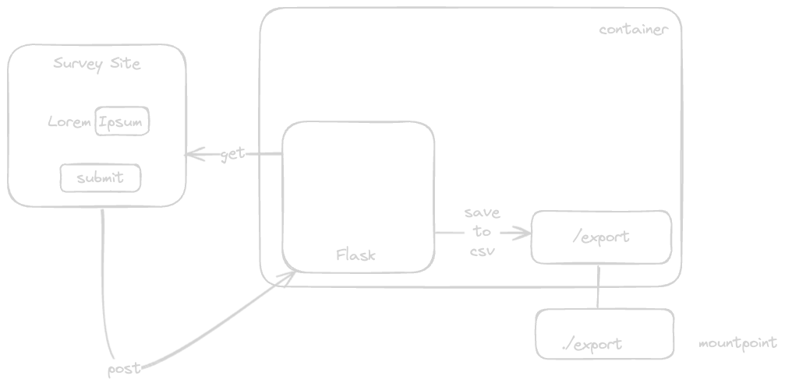

# Clickable Word Survey

**Please note that this project is currently under development and at this point not easy to customize.**

This clickable survey is an python flask application.

## Todo
- [ ] save result in database or csv
- [ ] remove bootstrap cdn (use local)
- [ ] customizeable input fields with pre-selection

## Usage

**requirements:**
- docker

## Installation

## Configuration

## How does it work?

Flask is providing at the default `/` URL the `index.html`. The HTML is located in `docker/app/template/index.html` and sends `POST` requests back to the flask API. 

